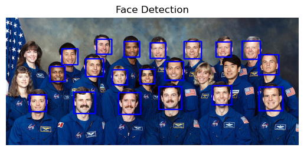

# 5.Face-Detection
# Face Detection using OpenCV

This repository demonstrates a simple face detection application using the OpenCV library in Python. The provided script utilizes a pre-trained Haar Cascade classifier for frontal face detection.

## Prerequisites

Make sure to install the required libraries before running the code.

## Original Image

## Detected faces

